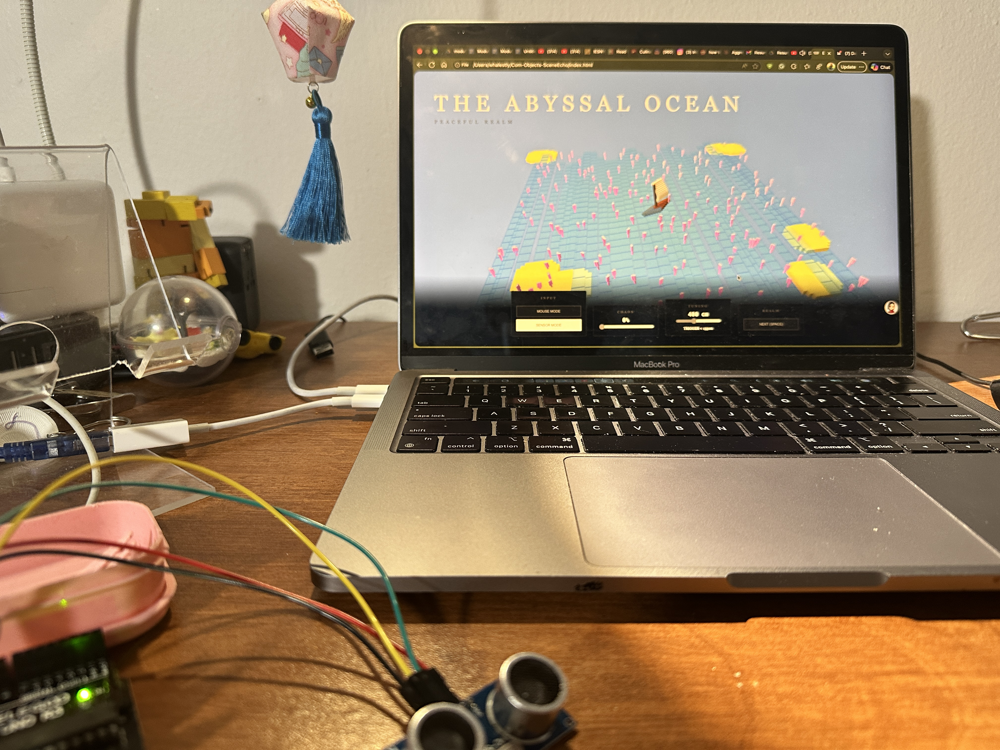

# Echoes of Eternity: A Voxel Diorama Journey

**Echoes of Eternity** is an interactive generative art project that bridges the physical and digital realms. Using an Arduino-powered sensor, travelers can influence the "Chaos" of a sprawling, high-fidelity voxel fantasy world in real-time.

## 🌌 The Journey
Journey through four distinct mystical realms, each with its own peaceful and chaotic state:
- **The Golden Field:** A lush carpet of multi-colored flowers surrounding an ancient, colossal cathedral arch.
- **The Elder Village:** A dense, ancient forest swarm filled with giant trees, cozy cottages, and wild deer.
- **The Highland Peaks:** Jagged, solid rock monoliths viewed from a majestic dragon's-eye perspective.
- **The Abyssal Ocean:** A translucent, multi-layered deep sea featuring a detailed galleon and vibrant coral reefs.

## 🛠️ The Tools
- **Arduino Uno:** Acts as the mystical core, processing signals from the physical world and communicating them to the digital canvas.
- **HC-SR04 Ultrasonic Sensor:** The "eye" of the project. It emits high-frequency sound waves to measure the proximity of your hand, translating physical distance into digital chaos.

## 💻 The Code
### Firmware (src/main.cpp)
Written in C++ using PlatformIO, the firmware features a **Median Filter** algorithm. It captures five rapid sonar readings and selects the median value to eliminate electrical noise and "ghost" echoes, providing a rock-solid data stream to the browser.

### Frontend (index.html)
A high-performance **p5.js (WEBGL)** engine. 
- **High-Fidelity Voxel Modeling:** Objects are constructed from dozens of micro-voxels rather than simple blocks to achieve a "constructed" look.
- **Hybrid Input System:** Features a dual-mode interaction model allowing for both Arduino Sensor input and a Mouse-Y fallback.
- **Dynamic Physics:** Flowers and trees utilize sine-wave mathematics to simulate wind sway and chaotic turbulence.

## 🚀 Getting Started
1. **Flash the Arduino:** Upload the firmware in `src/main.cpp` to your Arduino Uno.
2. **Connect:** Open `index.html` in a Web Serial compatible browser (Chrome or Edge).
3. **Calibrate:** Click "BEGIN," select your sensor port, and use the "CALIBRATE" or "TRIGGER" slider to tune the experience to your specific environment.

---
*Created with belief, logic, and a touch of voxel magic.*
